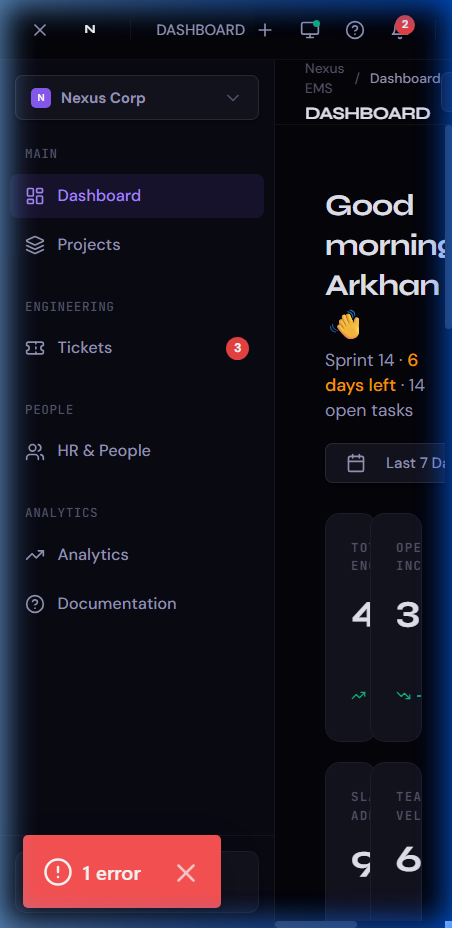
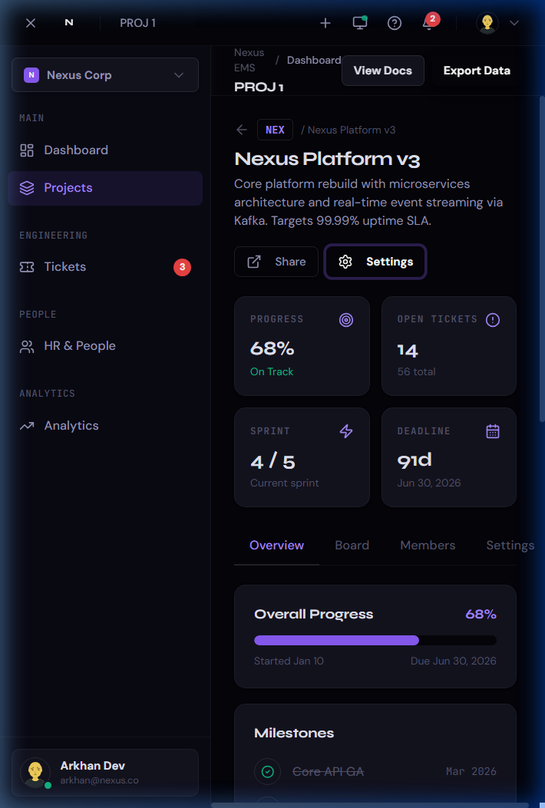
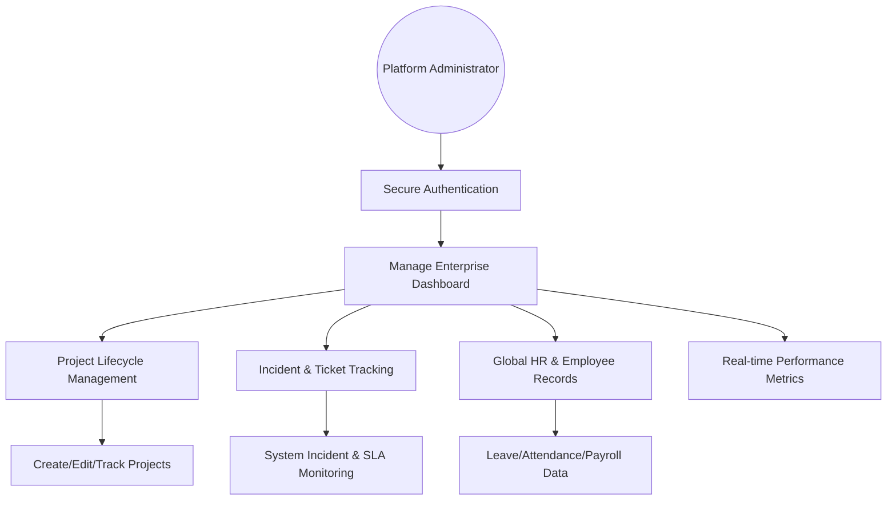
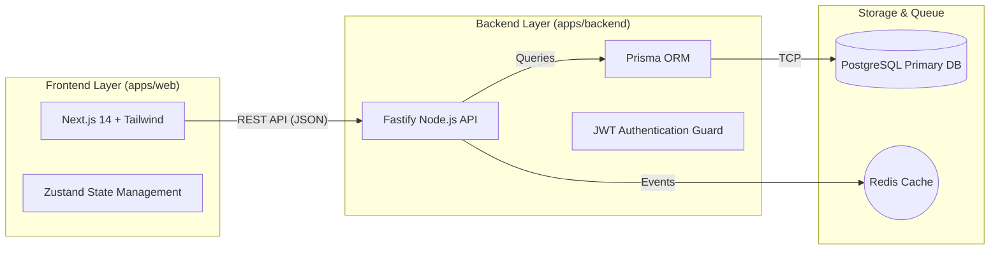
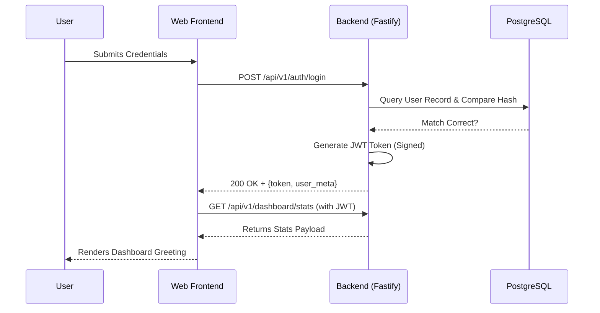

# 🛡️ Nexus EMS — Enterprise Management System

[](https://nextjs.org/)
[](https://fastify.io/)
[](https://www.postgresql.org/)
[](https://github.com/wi5nuu/Nexus-EMS)

Developed with precision and enterprise-grade architecture by **Wisnu Alfian Nur Ashar**.

---

## 🏛️ Executive Summary

**Nexus EMS** is a high-density, mobile-first Enterprise Management System designed for modern engineering teams. It provides a centralized hub for **Project Tracking**, **Incident Management (Tickets)**, and **Global HR Operations**. 

The platform features an "Extreme Compact" UI philosophy, multi-language support (English, Indonesian, Chinese, Spanish, Japanese), and a robust monorepo architecture built for scalability and performance.

---

## 📸 Snapshot Gallery

<div align="center">
  
  <br />
  <em>Fig 1: Extreme Compact Mobile Dashboard with Real-time Analytics & Multi-language Support</em>
  <br /><br />
  
  <br />
  <em>Fig 2: Desktop Project Management Interface with Kanban & SLA Tracking</em>
</div>

---

## 🛠️ System Architecture

Nexus EMS follows a modern Monorepo structure, separating concerns between a responsive high-performance Frontend and a high-throughput API Backend.

### 🧩 Use Case Diagram


### 🏗️ Technical Architecture


### 🔄 Authentication Sequence Flow


---

## 🚀 Key Features

- **Extreme Compact UI**: Balanced high-density information display for professionals.
- **Global Localization**: Support for **EN, ID, ZH, ES, JA** via persistent global state.
- **Intelligent Dashboard**: Real-time KPI cards (Scale, Issues, SLA, Velocity).
- **Incident Engine**: High-priority ticket management with SLA adherence tracking.
- **HR Suite**: Complete management of Leave, Attendance, Payroll, and Performance.
- **Project Kanban**: Interactive boards for engineering task lifecycle.

---

## 💻 Technical Stack

| Category | Technologies |
|---|---|
| **Frontend** | Next.js 14 (App Router), React, Tailwind CSS, Framer Motion |
| **Backend** | Fastify (Node.js), TypeScript, Prisma ORM, JWT |
| **State** | Zustand (Global persistence), React Query (Server state) |
| **Database** | PostgreSQL, Redis (Caching/Events) |
| **Infrastructure** | Docker Compose, Vercel, Render |

---

## ⚙️ Installation & Development

### Prerequisites
- Node.js 18+
- Docker & Docker Compose
- pnpm (Recommended)

### Local Setup
1. **Clone the repository**:
   ```bash
   git clone https://github.com/wi5nuu/Nexus-EMS.git
   cd Nexus-EMS
   ```

2. **Install Dependencies**:
   ```bash
   pnpm install
   ```

3. **Setup Database**:
   ```bash
   # Start PostgreSQL and Redis via Docker
   npm run db:up
   ```

4. **Internal Configuration**:
   - Copy `.env.example` to `.env` in both `apps/web` and `apps/backend`.
   - Update secrets and database URLs.

5. **Run Development Server**:
   ```bash
   # Runs both Web and Backend concurrently
   npm run dev:web
   npm run dev:backend
   ```

---

## ⚖️ License & Usage Policy

Copyright © 2026 **Wisnu Alfian Nur Ashar**.

### 🔍 Policy & Terms
1. **Purpose**: This repository is a platform showcase for enterprise system design.
2. **Personal Use**: You are free to view and fork the code for learning purposes.
3. **commercial Use**: **Not permitted**. The core business logic and "Extreme Compact" design system are proprietary intellectual properties.
4. **Attribution**: If any part of this code is used in public educational content, credit must be given to the original author.

---

## 🛡️ Security
We take security seriously. Please refer to our [SECURITY.md](SECURITY.md) for vulnerability reporting.

---

<p align="center">
  Built with ❤️ by <strong>Wisnu Alfian Nur Ashar</strong>
</p>
